# Guide on tuning context sparsity

When running THICK for a new environment, the hyperparameter $\beta^{\mathrm{sparse}}$, or `loss_scales.sparse`, needs to be tuned. 
Fortunately, this is straightforward once you know the procedure.
In this tutorial, we walk you through the process using two example tasks: **Pong** and **Q*bert**, both from the Atari suite and not included in our original paper.

### What is $\beta^{\mathrm{sparse}}$ and why is it important?
$\beta^{\mathrm{sparse}}$ scales the loss term that penalizes changes to the context vector, i.e., a latent state in the low-level world model that compresses temporal activity.
Increasing $\beta^{\mathrm{sparse}}$ penalizes context changes more strongly, which makes context changes less frequently over time.

The high-level world model is trained to predict only states with context changes. 
Thus, $\beta^{\mathrm{sparse}}$ directly influences the temporal abstractions learned by THICK: it effectively controls the time scale of abstraction.
- If $\beta^{\mathrm{sparse}}$ is set too high, the context never changes, and the high-level world model receives no training.
- If $\beta^{\mathrm{sparse}}$ is set too low, the context changes almost every time step, forcing the high-level world model to predict at every step rather than developing temporally abstract predictions.

### Tuning sparsity 
$\beta^{\mathrm{sparse}}$ does not need to be tuned precisely; usually, finding the correct order of magnitude is sufficient.
To do this, we run one seed with three different values of $\beta^{\mathrm{sparse}} \in (1, 10, 100)$ for both tasks `atari100k_pong` and `atari100k_qbert`. 

```sh
python dreamerv3/main.py \
  --logdir ~/logdir/{timestamp}_qbert_beta_1 \
  --configs atari100k thick size25m\
  --task atari100k_qbert
  --loss_scales.sparse 1
  --run.steps 1e6
```
To replicate this, simply rerun the above command with different values of `--task` and `--loss_scales.sparse`.

Once the runs are finished, we can analyze context changes and high-level predictions in TensorBoard or Weights & Biases (W&B).
The most important diagnostic metric for tuning $\beta^{\mathrm{sparse}}$ is the **average number of time steps in which the context vector is updated**. 
Ideally, this number should be small but strictly greater than zero.
In TensorBoard, this metric is reported as *mean_log_context_change*.

<p align="center">
  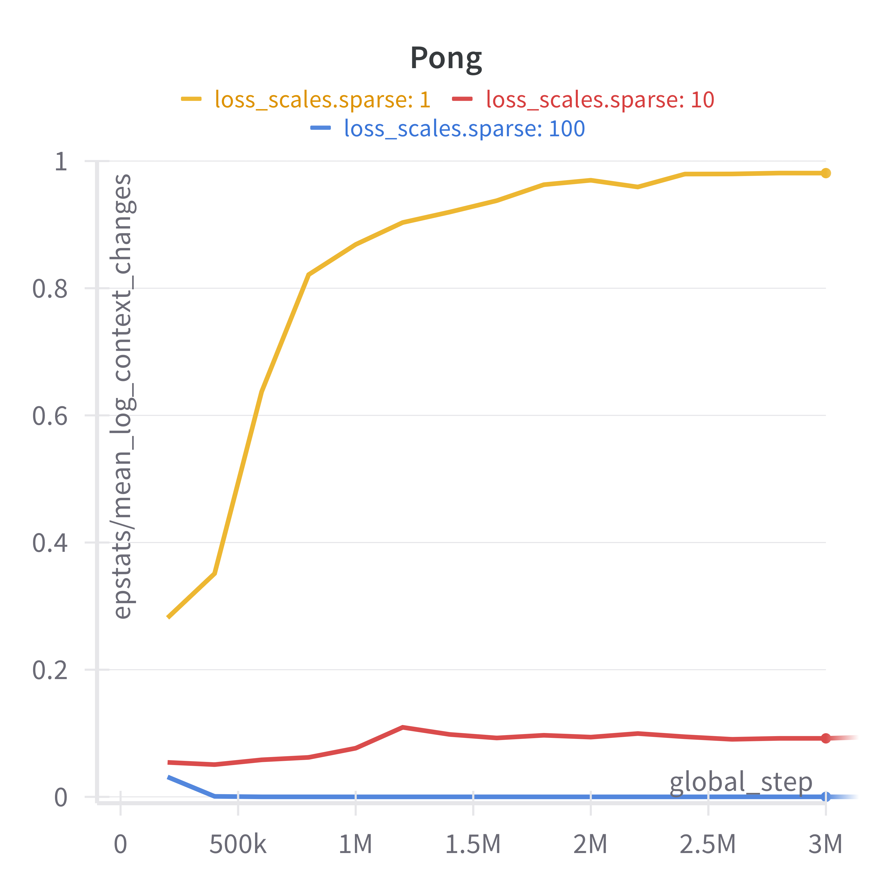
  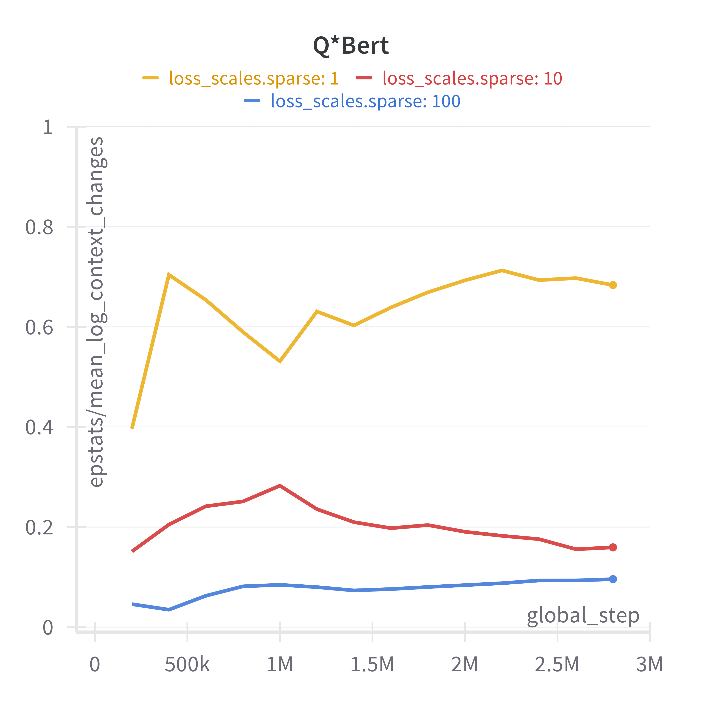
</p>

As you can see, $\beta^{\mathrm{sparse}} = 1$ provides too little regularization in both tasks, leading to frequent context changes.  
For Pong, $\beta^{\mathrm{sparse}} = 100$ is overly restrictive, and the context remains constant (no changes).  
A value of $\beta^{\mathrm{sparse}} = 10$ produces reasonable results for both tasks.

Poorly tuned regularization can also negatively affect other metrics, as seen in the scores achieved in Pong:

<p align="center">
  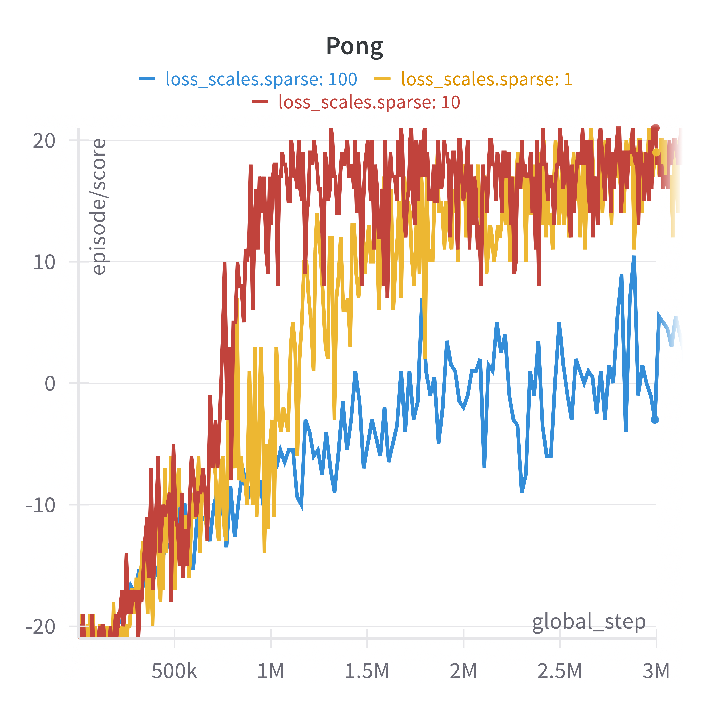
</p>

In principle, :star:**we are done here**:star:. 
We have identified a good setting of $\beta^{\mathrm{sparse}} = 10$. 
As it turns out, this value works well across most Atari tasks.
In the remainder of this guide, we will qualitatively verify that the learned contexts and temporal abstractions are indeed reasonable.  

### Qualitative visualizations

To build an intuitive understanding of the latent state segmentation, we log several qualitative visualizations in TensorBoard or W&B. 
For example, *policy_log_obs_with_context_change* displays exemplary episodes by showing the observations (left) alongside indicators of whether the context vector was updated (green) or not (red). 
Here is a snippet:

<p align="center">
  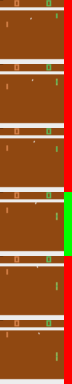 &nbsp;&nbsp;&nbsp;&nbsp;&nbsp;&nbsp;
  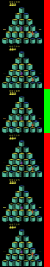
</p>

In Pong, context changes typically occur when the ball hits the walls or paddles. In Q*bert, the context can change when the agent (in red) jumps onto a new platform and activates it (turning it yellow).


Next, we can look at the predictions of the high-level world model and learned high-level actions $A_i$. 
For exemplary sequences, we visualize the predictions in *hlwm_next_context_recon*. 
From left to right the table shows the 1) observation $o_{t}$, 2) the reconstruction from the low-level, 3) reconstrcutions from high-level prediction for each high-level action $A_{1,t}$ to $A_{N,t}$ and 4) the reconstruction for the sampled high-level action $A_t$.

  
| $o_t$    | low-level | $A_{1,t}$ | $A_{2,t}$ | $A_{3,t}$ | $A_{t}$ | 
|----------|-----------|-----------|-----------|-----------|---------|
|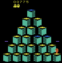|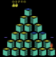|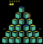||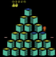||


Finally, with `utils/make_prediction_gifs.py` we can visualize the predictions from the low- or high-level world model as GIFs. 


  
| inputs | low-level predictions | high-level predictions | 
|----------|-----------|-----------|
| 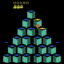 | 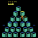 | 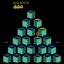 |
